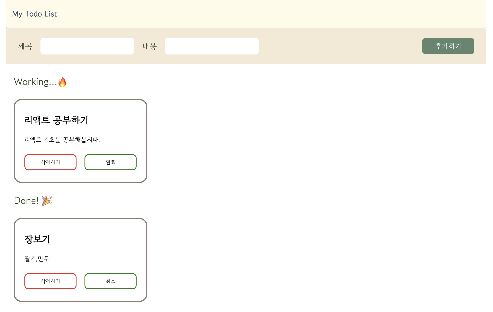
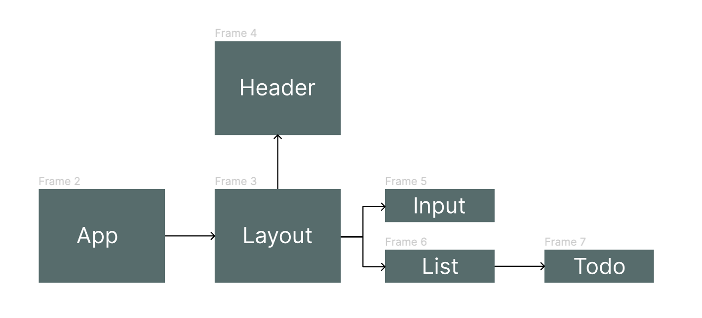

# 프로젝트 To Do List 🧭

React JS로 To Do List 만들기 😉
 

 
 

# 요구 사항

1. 제목과 내용을 입력하고, [추가하기] 버튼을 클릭하면 Working에 새로운 Todo가 추가되고 제목 input과 내용 input은 다시 빈 값으로 바뀌도록 구성해주세요.
2. Todo의 **isDone 상태가 true이면, 상태 버튼의 라벨을 `취소`, isDone이 false 이면 라벨을 `완료`** 로 조건부 렌더링 해주세요.
3. Todo의 상태가 `Working` 이면 위쪽에 위치하고, `Done`이면 아래쪽에 위치하도록 구현합니다.
4. Layout의 최대 넓이는 `1200px`, 최소 넓이는 `800px`로 제한하고, 전체 화면의 가운데로 정렬해주세요.

 
 

# 구현한 기능

- UI 디자인
- Todo 추가 하기
- Todo 삭제 하기
- Todo 완료 상태 변경하기 (완료 ↔ 진행중)

 
 

# 사용한 Hook

**useState**
 
 

# 컴포넌트 구조

- App : 기본 데이터가 들어있는 컴포넌트. Layout컴포넌트 내부에 Input컴포넌트와 List컴포넌트를 넣어서 return하고 props로 데이터를 전달하고 있다.

- Layout : 기본 골격 구조를 위해 만든 컴포넌트. Header컴포넌트를 품고있다.

- Input : input에서 입력받은 값을 App컴포넌트의 기본데이터에 useState로 업데이트한다.

- List : Todo List가 나오는 전체 구역으로 삭제 및 상태 변경 함수가 있으며 props로 Todo컴포넌트에게 전달한다.

- Todo : Todo의 내용과 버튼이 나오는 상자를 만드는 컴포넌트.

